# Web Based Job Editor (WBJE)

## Inhoudsopgave

- [1. Projectomschrijving](#1-projectomschrijving)

- [2. Domeinmodel](#2-domeinmodel)
    - [2.1 Omschrijving domeinmodel](#2-1-omschrijving-domeinmodel)
    - [2.2 Entiteiten](#2-2-entiteiten)

- [3. Sequence diagrams](#3-sequence-diagrams)
    - [3.1 Get Job](#3-1-get-job)
    - [3.2 Omschrijving Get Job operatie](#3-2-omschrijving-get-job-operatie)
    - [3.3 DELETE Report-Spec](#3-3-delete-job)
    - [3.4 Omschrijving DELETE Report-Spec](#3-4-omschrijving-job-delete-operatie)

- [4. Installatie, configuratie en testen](#4-installatie-configuratie-en-testen)
    - [4.1 Vereiste tools](#4-1-vereiste-tools)
    - [4.2 Maven dependencies](#4-2-maven-dependencies)
    - [4.3 Keycloak configuratie](#4-3-keycloak-configuratie-windows) (windows)
        - [4.3.1 Installeren en starten](#4-3-1-installeren-en-starten)
        - [4.3.2 Admin-account aanmaken](#4-3-2-admin-account-aanmaken)
        - [4.3.3 WBJE-realm importeren](#4-3-3-wbje-realm-importeren)
        - [4.3.4 Realmconfiguratie overzicht](#4-3-4-realmconfiguratie-overzicht)
    - [4.4 PostgreSQL configuratie](#4-4-postgresql-database-configuratie)
    - [4.5 API starten via IntelliJ](#4-5-api-starten-via-intellij)
    - [4.6 Swagger en OpenAPI](#4-6-swagger-en-openapi)
    - [4.7 Testen met Postman](#4-7-testen-met-postman)
    - [4.8 Testen in IntelliJ IDEA 2025.2.1](#4-8-Testen-in-IntelliJ-IDEA-2025.2.1)
    - [4.9 Tests uitvoeren](#4-9-tests-uitvoeren)

- [5. API-documentatie en endpoints](#5-api-documentatie-en-endpoints)
    - [5.1 API-documentatie](#5-1-api-documentatie)
    - [5.2 Overzicht van beschikbare resources](#5-2-overzicht-van-beschikbare-resources)


## 1. Projectomschrijving

De Web Based Job Editor (WBJE) API vormt de stateless backend voor het aanmaken, bewerken en valideren van montagejobs voor de FAMM 3.0 van AV Flexologic – een volautomatische flexo-plaatmontagemachine met hoge snelheids- en nauwkeurigheidseisen.


Waar de huidige Job Editor fysiek op de machine draait en daardoor productiestilstand veroorzaakt, maakt deze webgebaseerde API het mogelijk om extern en parallel jobs aan te maken zonder de montage te onderbreken. De API faciliteert alle datastromen tussen gebruikersinterface, database en machineconfiguratie.

## Kernfunctionaliteiten

- **Jobbeheer** – aanmaken, wijzigen en verwijderen van montagejobs.
- **Gebruikersrechtenbeheer** – Gebruikersrechtenbeheer op basis van Operator en Service rollen.
- **Jobvalidatie** – automatische controle op volledigheid en technische correctheid voordat productie start.
- **Authenticatie (inloggen & registreren)** – beveiligde toegang tot functionaliteiten binnen de web-API. Authenticatie via Keycloak.
- **Bestandsbeheer** – upload en download van bijvoorbeeld jobtemplates en configuratiebestanden.


### Projectstructuur

De backend hanteert een gelaagde architectuur waarin verantwoordelijkheden helder zijn gescheiden. Dit bevordert onderhoudbaarheid, testbaarheid en consistent gedrag over de gehele applicatie.

### Controllers

Bevatten de REST-endpoints en verwerken inkomende verzoeken. Validatie vindt plaats op DTO-niveau. Controllers leveren bijna uitsluitend Response-DTO’s terug.

### Services

Implementeert de domeinlogica en bewaakt de toepassingsregels. Services koppelen validatie, mapping en repository-interactie tot één samenhangend geheel.

### Repositories

Spring Data JPA-interfaces voor persistency. Repositories abstraheren de database-interactie en leveren entiteiten aan de servicelaag.

### Entities

JPA-entiteiten waarin de domeinstructuur en onderlinge relaties zijn gedefinieerd. Tabellen zijn één-op-één gerepresenteerd met de entiteiten.

### DTO’s (request/response)

Datatransferobjecten die voorkomen dat interne entiteiten worden blootgesteld. Requests worden gevalideerd; responses bieden een gecontroleerde, stabiele datastructuur richting de client.

### Mappers

Zorgen voor de omzetting tussen entiteiten en DTO’s. Dit houdt conversielogica buiten de controllers en services en maakt deze onderdelen eenvoudiger te testen.

### Configuratie

Omvat beveiliging, OpenAPI, Jackson-instellingen en multipart-configuratie. Hiermee worden de generieke applicatie-eigenschappen centraal beheerd.

### Exceptions

Bevat domeinspecifieke excepties en een centrale exception handler. Fouten worden grotendeels uniform afgehandeld en vertaald naar consistente HTTP-responses.


<a id="2-domeinmodel"></a>

## 2. Domeinmodel


<a id="2-1-omschrijving-domeinmodel"></a>

### 2.1 Omschrijving domeinmodel

Het domeinmodel volgt hoe het werkproces in het echt gaat. Alles begint bij een job: dat is de complete opdracht. Binnen die job zitten de cylinders, en op die cylinders liggen de reports. De TapeSpec en ReportSpec staan bewust apart. Dit zijn vaste technische gegevens die niet bij elke job veranderen. Door die los te koppelen, worden ze niet telkens opnieuw opgeslagen en blijft het geheel overzichtelijk. Een cylinder verwijst simpelweg naar één TapeSpec, en een report naar één ReportSpec.

In principe komt het neer op:

- een job is de opdracht
- een cylinder is een onderdeel van die opdracht
- een report bevindt zich op die cylinder
- en de specificaties (spec) leveren de vaste technische info die overal hergebruikt wordt.

Op deze manier blijft het model helder, herkenbaar voor iedereen die ermee werkt, en flexibel genoeg om later verder uit te breiden.

<a id="2-2-entiteiten"></a>

### 2.2 Entiteiten

| Entiteit       | Omschrijving                                                 | Relaties                                           |
| -------------- | ------------------------------------------------------------ | -------------------------------------------------- |
| **Job**        | Centrale entiteit met algemente informatie over een productie opdracht | 1 → 0..1 Note<br>1 → 0..n Cylinders                |
| **Note**       | Aanvullende tekst bij een job.                               | 0..1 → 1 Job                                       |
| **Cylinder**   | Onderdeel binnen een job, met eigen nummering en eigenschappen (kleur en andere technische info) | 0..n → 1 Job<br>n → 1 TapeSpec<br>1 → 0..n Reports |
| **TapeSpec**   | Technische informatie van het tape type                      | 1 → 0..n Cylinders                                 |
| **Report**     | Zijn de platen die zicht op een cylinder bevinden.           | 0..n → 1 Cylinder<br>0..n → 1 ReportSpec           |
| **ReportSpec** | Technische informatie van het plaattype                      | 1 → 0..n Reports                                   |

<a id="3-sequence-diagrams"></a>

## 3. Sequence diagrams

<a id="3-1-get-job"></a>

### 3.1 Get Job

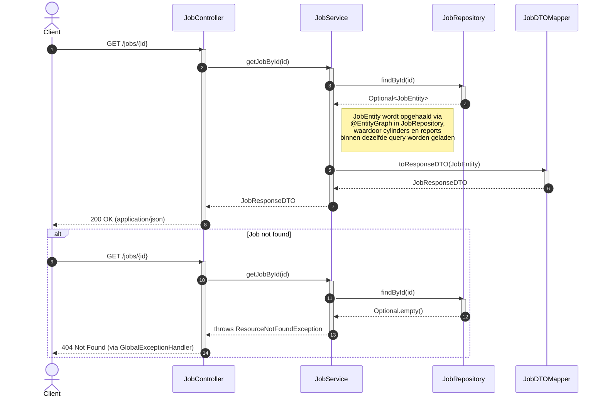

<a id="3-2-omschrijving-get-job-operatie"></a>

### 3.2 Omschrijving Get Job operatie

Dit sequentiediagram beschrijft alle stappen die doorlopen worden wanneer een client een **GET-verzoek** uitvoert op het endpoint **`/jobs/{id}`**. Er mag worden aangenomen dat de authenticatie via Keycloak succesvol was, en dat de juiste rollen zijn gevalideerd. Vanaf dit punt start het diagram: de aanvraag begint direct bij de `JobController`.

Deze controller roept vervolgens de `JobService` aan om de gewenste job op te halen. De service verzamelt de complete `JobEntity`, waarbij ook alle gerelateerde *Cylinders* en de onderliggende *Reports* worden geladen. Nadat deze stap is doorlopen, wordt de volledige structuur via de `JobDTOMapper` vertaald naar een `JobResponseDTO`. Deze response wordt door de controller teruggegeven aan de client met de statuscode **200 OK**.

Het diagram bevat daarnaast één alternatief scenario:

- **404**: wanneer de gevraagde job niet bestaat.

Dit alternatieve pad zorgt ervoor dat ook de uitzonderingssituatie wordt weergegeven, waardoor de volledige verwerkingslogica in één oogopslag zichtbaar is.

---

<a id="3-3-delete-job"></a>

### 3.3 DELETE Report-Spec

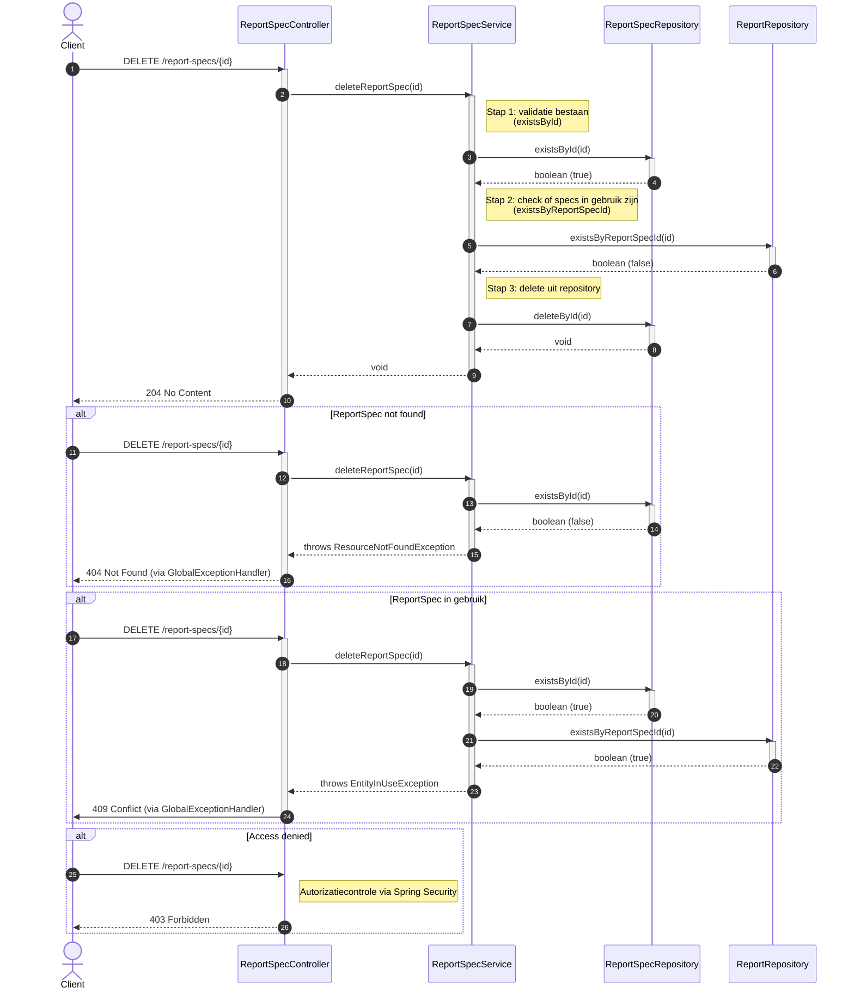

<a id="3-4-omschrijving-job-delete-operatie"></a>

### 3.4 Omschrijving DELETE Report-Spec

Dit sequentiediagram beschrijft alle stappen die doorlopen worden wanneer een client een **DELETE-verzoek** uitvoert naar **`/report-specs/{id}`**. Ook hier mag worden aangenomen dat de authenticatie via Keycloak succesvol was, en dat de juiste rollen zijn gevalideerd. Vanaf dit punt start het diagram: de aanvraag begint direct bij de `ReportSpecController`.

Deze controller roept vervolgens de `ReportSpecService` aan om de verwijderoperatie uit te voeren. Binnen deze service wordt eerst gecontroleerd of de opgegeven *ReportSpec* bestaat. Indien dit het geval is, wordt vastgesteld of de betreffende specificatie nog in gebruik is bij één of meerdere *Reports*. Wanneer deze controle negatief uitvalt (de specificatie is niet gekoppeld aan bestaande reports), wordt de *ReportSpec* uit de database verwijderd. De controller retourneert vervolgens een **204 No Content** als bevestiging van de succesvolle verwijdering.

Het diagram bevat daarnaast drie alternatieve scenario’s:

- **403**: de gebruiker beschikt niet over de vereiste rol om deze bewerking uit te voeren.
- **404**: de opgegeven *ReportSpec* bestaat niet.
- **409**: de *ReportSpec* kan niet worden verwijderd omdat deze nog in gebruik is.

Deze alternatieven maken de volledige verwerkingsketen inzichtelijk, inclusief alle uitzonderingspaden die kunnen optreden tijdens de verwijderoperatie.

<a id="4-benodigde-dependencies,-tools-en-stappen-om-de-api-te-draaien"></a>

## 4. Installatie, configuratie en Starten van de WBJE-API

Dit hoofdstuk beschrijft alle vereiste tools, afhankelijkheden, configuratiestappen en procedures om de WBJE-API lokaal te draaien, te testen en te benaderen. De workflow is gebaseerd op IntelliJ IDEA, Maven, Spring Boot, Keycloak, PostgreSQL en Postman.

---

<a id="4-1-vereiste-tools"></a>

### 4.1 Vereiste tools

De volgende tools zijn noodzakelijk voor lokale ontwikkeling en uitvoering:

- **Java Development Kit (JDK 17)**
- **IntelliJ IDEA**
- **Maven (3.8+)**
- **Keycloak (22+)**
- **PostgreSQL**
- **Postman**

---

<a id="4-2-maven-dependencies"></a>

### 4.2 Maven dependencies

- `spring-boot-starter-web`
- `spring-boot-starter-data-jpa`
- `spring-boot-starter-security`
- `spring-boot-starter-validation`
- PostgreSQL JDBC-driver
- OAuth2 Resource Server
- springdoc-openapi
- JUnit + Mockito

---

<a id="4-3-keycloak-installeren-en-starten-(windows)"></a>

### 4.3 Keycloak configuratie (Windows)

<a id="4-3-1-installeren-en-starten"></a>

#### 4.3.1 Installeren en starten

#### Installatie

1. Download Keycloak via https://www.keycloak.org/downloads
2. Pak het zip-bestand uit.
3. Open een terminal in de Keycloak-map.

#### Starten

```
bin\kc.bat start-dev --http-port 9090
```

- Keycloak draait op `http://localhost:9090`
- Developer-mode is verplicht tijdens lokale ontwikkeling.

<a id="4-3-2-admin-account-aanmaken"></a>

#### 4.3.2 Admin-account aanmaken

Wanneer Keycloak voor de eerste keer wordt opgestart:

1. Navigeer naar:  
   `http://localhost:9090`

2. Maak vervolgens het Keycloak administrator-account aan.  
   Voor lokale ontwikkeling wordt aangeraden om de volgende inloggegevens te gebruiken:

**Gebruikersnaam:** `admin`  
**Wachtwoord:** `admin`

*(Deze waarden zijn uitsluitend geschikt voor development. Gebruik in productie altijd sterke, unieke credentials.)*

3. Log daarna in op de Admin Console met dit nieuwe admin-account.

---

<a id="4-3-3-wbje-realm-importeren"></a>

#### 4.3.3 WBJE-realm importeren

1. Start Keycloak.
2. Open de **Admin Console**.
3. Links bovenin → Realm selector → klik op **Create realm**.
4. In het scherm **Create realm**:
    - Onder **Import from resource file** klik je op **Browse…**.
    - Selecteer het bestand `WBJE_realm-export.json`.
    - De realmnaam wordt automatisch ingevuld (of vul `WBJE` in wanneer dit niet gebeurt).
    - Zorg dat de slider **Enabled** direct op **ON** gezet wordt.
5. Klik op **Create** om de realm aan te maken op basis van het geïmporteerde bestand.

Na deze stappen is de volledige WBJE-securityconfiguratie (rollen, clients, realm-instellingen) actief en klaar voor gebruik.

---

<a id="4-3-4-realmconfiguratie-overzicht"></a>

#### 4.3.4 Realmconfiguratie overzicht

#### Realm

- Naam: `WBJE`
- Access token lifespan: `300s`

#### Rollen (client-rollen)

- **ROLE_ADMIN**
    - Username: `Operator`
- **ROLE_USER**
    - Username: `Service`

#### Backend Client

- Client ID: `WBJEBackend`
- Protocol: OpenID Connect

#### Redirect URIs

- `http://localhost:8080/swagger-ui/oauth2-redirect.html`
- `https://oauth.pstmn.io/v1/callback`
- `*` (voor development)

#### Web Origins

- `/*`
- `*`

---

<a id="4-4-postgresql-configuratie"></a>

### 4.4 PostgreSQL database configuratie

De PostgreSQL‑database dient vooraf ingericht te worden zodat de WBJE API correct kan verbinden en schema’s kan aanmaken.

#### Database aanmaken

Maak een nieuwe database aan:

- **Database naam:** `wbje`
- **Gebruiker:** `postgres`
- **Wachtwoord:** `password`

Gebruik hiervoor bijvoorbeeld psql:

```sql
CREATE DATABASE wbje;
CREATE USER postgres WITH ENCRYPTED PASSWORD 'password';
GRANT ALL PRIVILEGES ON DATABASE wbje TO postgres;
```

#### JDBC configuratie in Spring Boot

De applicatie maakt verbinding met een PostgreSQL-database via de standaard JDBC-configuratie in `application.properties`. Hierbij wordt uitgegaan van een lokaal draaiende PostgreSQL-instantie op poort `5432` en een bestaande database met de naam `wbje`. Indien PostgreSQL op een andere poort of host actief is, dient de `spring.datasource.url` overeenkomstig te worden aangepast.

De configuratie ziet er momenteel zo uitt:

```
spring.datasource.url=jdbc:postgresql://localhost:5432/wbje
spring.datasource.username=postgres
spring.datasource.password=password
```

<a id="4-5-api-starten-via-intellij"></a>

### 4.5 API starten via IntelliJ


Het project kan op meerdere manieren in IntelliJ IDEA worden geopend: rechtstreeks vanuit de repository, via een lokale projectmap, of via een pull request. Voor alle opties geldt dezelfde vervolgstap om de API te starten.

---

### Project openen

1. Open **IntelliJ IDEA**.
2. Kies één van de volgende opties:
    - **File → Open…** en selecteer de projectmap,
    - **Git → Clone…** en vul de repository-URL in,
    - **Git → GitHub → View Pull Requests** en kies **Checkout Pull Request**.
3. IntelliJ herkent automatisch de `pom.xml` en importeert het Maven‑project.
4. Wacht tot rechtsonder **“Maven project imported”** verschijnt.

---

### De WBJE API starten

1. Navigeer naar:

   ```
   src/main/java/.../WbjeApplication.java
   ```

2. Open dit bestand.

3. Start de applicatie via:

    - **Right‑click → Run 'WbjeApplication'**, of
    - De **groene Run‑knop**.

4. Nadat de applicatie is gestart, is de API bereikbaar op:

   ```
   http://localhost:8080
   ```

Bij het opstarten wordt automatisch het `data.sql`-bestand uitgevoerd. Dit script leegt eerst alle tabellen (via `TRUNCATE ... CASCADE`) en vult de database vervolgens opnieuw met voorbeelddata. De applicatie start daardoor telkens met een volledig gevulde en consistente database.

Indien een schone herinitialisatie gewenst is, volstaat het om de API opnieuw te starten. De database wordt dan opnieuw gereset en gevuld.

Met deze stappen kan de WBJE‑backend eenvoudig lokaal worden uitgevoerd, ongeacht hoe het project is geladen.


---

<a id="4-6-swagger-en-openapi"></a>

### 4.6 Swagger en OpenAPI

Swagger en OpenAPI vormen de auto-gegenereerde documentatie van de WBJE-API.  
Wanneer de Spring Boot-applicatie draait, wordt automatisch een complete en interactieve UI beschikbaar gesteld via Swagger. Hiermee kun je:

- alle endpoints bekijken
- per endpoint zien welke HTTP-methoden worden ondersteund
- request- en response-modellen inzien
- direct API-calls uitvoeren **zonder Postman**

- de volledige API-specificatie downloaden als **OpenAPI YAML**

Swagger UI is ideaal voor debugging, functioneel testen, API-review, en verificatie van mappers/DTO’s.

### Swagger UI

Swagger UI is beschikbaar via:

```
http://localhost:8080/swagger-ui/index.html
```

Het opent een interactieve webpagina zoals hieronder:

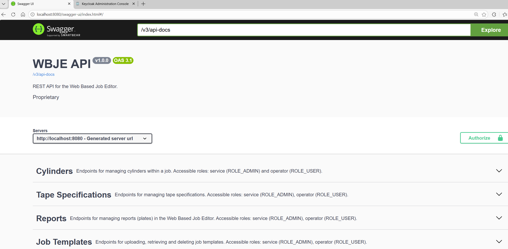

### OpenAPI YAML

De volledige OpenAPI-specificatie (machine-leesbaar, bedoeld voor tooling) is beschikbaar op:

```
http://localhost:8080/v3/api-docs.yaml
```

Deze YAML-file kan worden gebruikt voor:

- genereren van client-SDK’s (TypeScript, Java, C#, Python, etc.)
- importeren in Postman
- API-validatie
- documentatie-automation
- CI/CD-validatie (contract-tests)

Springdoc genereert deze YAML live op basis van controllers, DTO’s, validatie-annotaties en Swagger-configuratie.

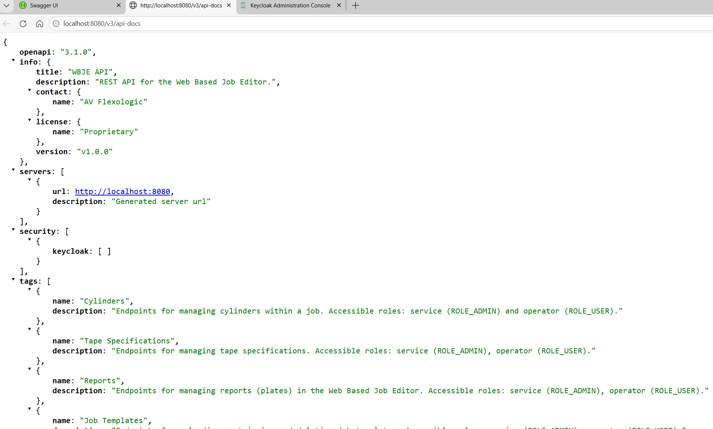

---

<a id="4-7-testen-met-postman"></a>

## 4.7 Testen met Postman – Geautomatiseerde gecombineerde tests

De meegeleverde Postman-collectie bevat een volledig geautomatiseerde testworkflow waarin:

- OAuth2 login (Operator + Service)
- RBAC-validatie
- Volledige CRUD-flow (TapeSpec → ReportSpec → Job → Cylinder → Report)
- Negatieve scenario’s (403 / 404 / 409 / 422)
- Cleanup van alle aangemaakte resources

gecombineerd worden in één consistente integratietest.

De collectie heet:

> **WBJE – Full Combined tests Service vs Operator**

------

### Voorbereiding

1. Start **Keycloak**
2. Start de **WBJE API**
3. Open **Postman**
4. Importeer de collectie `WBJE.postman_collection.json`
5. Controleer of de environment-variabele `baseUrl` correct staat
   *(standaard: `http://localhost:8080`)*

------

### Teststructuur binnen de collectie

De collectie bevat twee hoofdscenario’s. Test 1 en Test 2

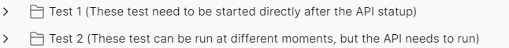

------

### Test 1

***(Direct na API-start uitvoeren)***

Dit scenario gebruikt data uit `data.sql`. Het moet direct na applicatie-start worden uitgevoerd, zonder dat tussentijds data is aangepast.

**Dit blok bevat:**

- Operator login
- RBAC-validatie (ROLE_USER)
- Service login
- Admin CRUD-operaties
- Job-template upload
- Cleanup

>⚠️ Wanneer er tussentijds data is gewijzigd, kan dit scenario falen.

>⚠️ Bij de test “[SV] POST /job-templates – allowed (ROLE_ADMIN)” moet wel in Postman een daadwerkelijk bestand  geselecteerd worden in het `file`-veld. Indien hier geen bestand geselecteerd staat zal deze test dus valen.
------

### Test 2

***(Volledig zelfstandig integratiescenario)***

Dit is een complete end-to-end workflow en kan op ieder moment worden uitgevoerd zolang de API draait.

**Dit scenario voert automatisch uit:**

1. Operator login
2. Service login
3. TapeSpec create → update → delete
4. ReportSpec create → update → delete
5. Job create → update → delete
6. Cylinder create → update → duplicate test
7. Report create → update → invalid reference test
8. Conflict tests (409 bij in-use resources)
9. Cleanup van alle aangemaakte entiteiten
10. Negatieve tests op reeds verwijderde resources

Alle ID’s worden automatisch opgeslagen in collection variables.

------

## Geautomatiseerde tests uitvoeren

### Stap 1 – Selecteer de collectie

Klik links op:

> **WBJE – Full Combined tests Service vs Operator**

------

### Stap 2 – Start de Runner

Klik op de drie puntjes naast de collectie en kies:

> **Run**

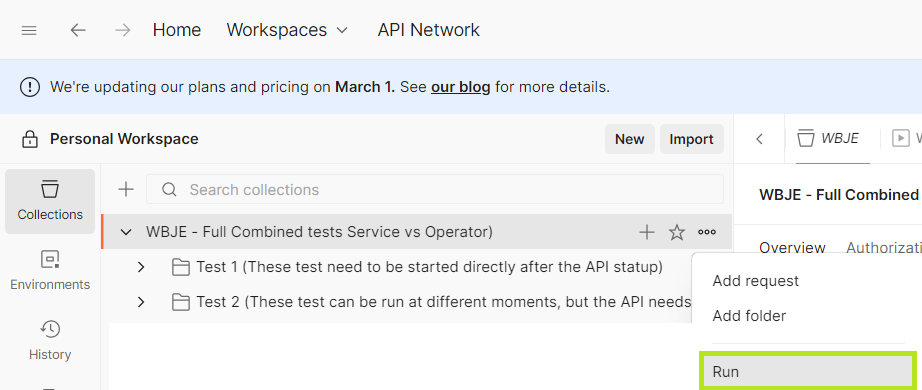

*(of gebruik de knop rechtsboven in het overzicht)*


------

### Stap 3 – Start de run

Klik op:

> **Run WBJE – Full Combined tests**
>
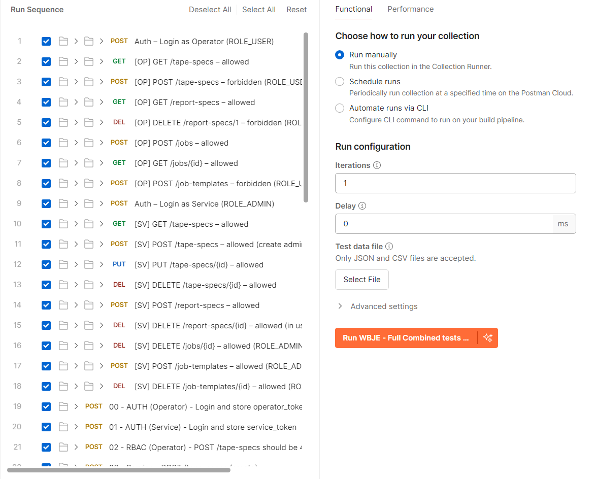

------

### Verwachte uitkomst

Bij een correct functionerende API:

- Alle tests: **56**
- Errors: **0**

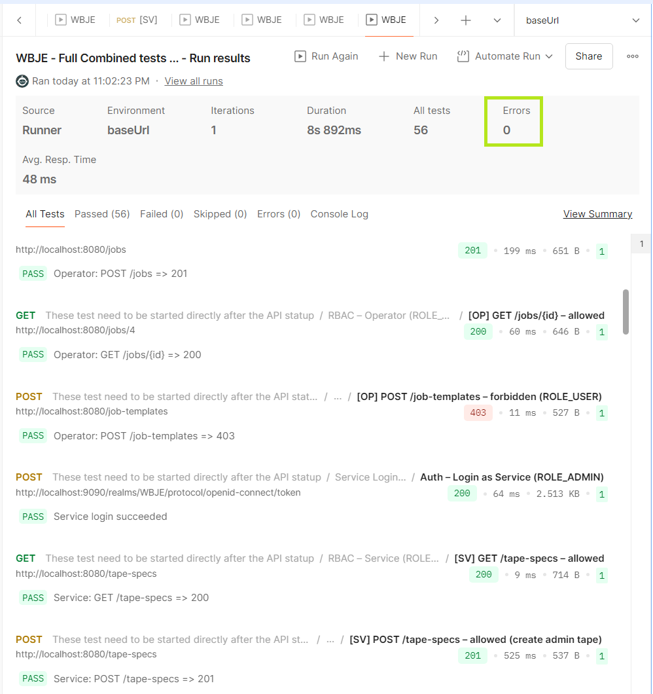

------

### Belangrijk bij Job Templates

Voor de test:

```
[SV] POST /job-templates – allowed (ROLE_ADMIN)
```

moet in Postman een **echt bestand** gekoppeld zijn aan het `file`-veld. Zonder bestand zal deze test falen.

------

### Resultaatinterpretatie

| Status    | Betekenis                        |
| --------- | -------------------------------- |
| 200 / 201 | Succesvolle create/update        |
| 204       | Succesvolle delete               |
| 403       | Correcte RBAC-afwijzing          |
| 404       | Resource bestaat niet            |
| 409       | Resource in use                  |
| 422       | Validatiefout                    |
| 500       | Onverwachte fout (implementatie) |

---

### Handmatige OAuth2-configuratie (indien nodig)

De collectie bevat per request een OAuth2-configuratie met de volgende parameters:

| Parameter         | Waarde                                                       |
| ----------------- | ------------------------------------------------------------ |
| **Auth URL**      | `http://localhost:9090/realms/WBJE/protocol/openid-connect/auth` |
| **Token URL**     | `http://localhost:9090/realms/WBJE/protocol/openid-connect/token` |
| **Client ID**     | `WBJEBackend`                                                |
| **Client Secret** | *(dezelfde secret als in jouw backend-project)*              |
| **Scope**         | `openid`                                                     |
| **Grant Type**    | Authorization Code of Password                               |
| **Browser login** | Enabled                                                      |

> Let op: in de Postman-collectie staat een *clientSecret* ingevuld.  
> Dit betekent dat jouw Keycloak-client is ingesteld als **confidential client**.

---

### Access token ophalen

1. Open een request zoals **GetStuff**
2. Ga naar **Authorization**
3. Kies **OAuth 2.0**
4. Klik **Get New Access Token**
5. Browser opent Keycloak-login
6. Log in als `operator` of `admin`
7. Klik **Use Token**

---

### Rollen & Autorisatie (RBAC)

De Web Based Job Editor (WBJE) maakt gebruik van Keycloak voor authenticatie en autorisatie.  
Binnen deze applicatie bestaan twee functionele rollen:

| Keycloak Rol   | Beschrijving                                                 |
| -------------- | ------------------------------------------------------------ |
| **ROLE_ADMIN** | Volledige beheertoegang. Mag alle entiteiten inclusief configuratie-objecten (TapeSpecs, ReportSpecs, Templates) aanmaken, wijzigen en verwijderen. |
| **ROLE_USER**  | Operator-rechten. Mag alle operationele entiteiten (Jobs, Cylinders, Reports) volledig beheren (CRUD). Mag configuratie-objecten uitsluitend lezen. |

## 👥 Testgebruikers

Voor testen met Swagger UI, Postman en de frontend kunnen de volgende Keycloak-gebruikers worden gebruikt:

| Username     | Password   | Toegewezen rol |
| ------------ | ---------- | -------------- |
| **Operator** | `password` | **ROLE_USER**  |
| **Service**  | `password` | **ROLE_ADMIN** |

---

## Role-Endpoint Matrix

Onderstaande tabel toont per endpoint en HTTP-methode welke rol toegang heeft.

> **Legenda:**  
> ✔ = toegang toegestaan  
> ✖ = geen toegang

| Endpoint                               | Methode | ROLE_ADMIN (Service) | ROLE_USER (Operator) |
| :------------------------------------- | ------- | -------------------- | -------------------- |
| `/tape-specs`                          | GET     | ✔                    | ✔                    |
| `/tape-specs`                          | POST    | ✔                    | ✖                    |
| `/tape-specs/{id}`                     | GET     | ✔                    | ✔                    |
| `/tape-specs/{id}`                     | PUT     | ✔                    | ✖                    |
| `/tape-specs/{id}`                     | DELETE  | ✔                    | ✖                    |
| `/report-specs`                        | GET     | ✔                    | ✔                    |
| `/report-specs`                        | POST    | ✔                    | ✖                    |
| `/report-specs/{id}`                   | GET     | ✔                    | ✔                    |
| `/report-specs/{id}`                   | PUT     | ✔                    | ✖                    |
| `/report-specs/{id}`                   | DELETE  | ✔                    | ✖                    |
| `/reports`                             | GET     | ✔                    | ✔                    |
| `/reports`                             | POST    | ✔                    | ✔                    |
| `/reports/{id}`                        | GET     | ✔                    | ✔                    |
| `/reports/{id}`                        | PUT     | ✔                    | ✔                    |
| `/reports/{id}`                        | DELETE  | ✔                    | ✔                    |
| `/jobs`                                | GET     | ✔                    | ✔                    |
| `/jobs`                                | POST    | ✔                    | ✔                    |
| `/jobs/{id}`                           | GET     | ✔                    | ✔                    |
| `/jobs/{id}`                           | PUT     | ✔                    | ✔                    |
| `/jobs/{id}`                           | DELETE  | ✔                    | ✔                    |
| `/jobs/full`                           | POST    | ✔                    | ✔                    |
| `/jobs/{jobId}/cylinders`              | GET     | ✔                    | ✔                    |
| `/jobs/{jobId}/cylinders`              | POST    | ✔                    | ✔                    |
| `/jobs/{jobId}/cylinders/{cylinderId}` | GET     | ✔                    | ✔                    |
| `/jobs/{jobId}/cylinders/{cylinderId}` | PUT     | ✔                    | ✔                    |
| `/jobs/{jobId}/cylinders/{cylinderId}` | DELETE  | ✔                    | ✔                    |
| `/job-templates`                       | GET     | ✔                    | ✔                    |
| `/job-templates`                       | POST    | ✔                    | ✖                    |
| `/job-templates/{id}`                  | GET     | ✔                    | ✔                    |
| `/job-templates/{id}`                  | DELETE  | ✔                    | ✖                    |
| `/job-templates/{id}/download`         | GET     | ✔                    | ✔                    |

---

<a id="4-8-Testen-in-IntelliJ-IDEA-2025.2.1"></a>

### 4.8 Testen in IntelliJ IDEA 2025.2.1

De WBJE-backend bevat zowel **unit tests** als **integration tests**.  
Samen zorgen deze voor verificatie van de individuele domeinlogica én de volledige applicatiestroom.

---

#### Unit Tests

Unit tests richten zich primair op de servicelaag.  
Repositories worden gemockt (Mockito), zodat uitsluitend de domeinlogica wordt getest.

De volgnde itemsn worden onder andere getest:

- correcte verwerking van businessregels
- juiste exception-handling (404, 409)
- correcte repository-interacties
- update- en delete-operaties

Unit tests draaien snel en zijn geïsoleerd van infrastructuurcomponenten.

---

#### Integration Tests

Integration tests starten een volledige Spring Boot testcontext en testen de complete request-flow via de controllerlaag.

Hierbij wordt gevalideerd dat:

- controller, service en repository correct samenwerken
- mapping naar DTO’s correct verloopt
- HTTP-statuscodes overeenkomen met de specificatie
- database-interactie correct plaatsvindt

De productie-API hoeft hiervoor niet handmatig te draaien; de testcontext wordt automatisch gestart.

---

#### Line Coverage

Line coverage geeft aan welk percentage van de broncode daadwerkelijk is uitgevoerd tijdens het draaien van de tests.

Binnen de servicelaag wordt 100% line coverage behaald op JobServiceImplementation en ReportSpecImplementation.

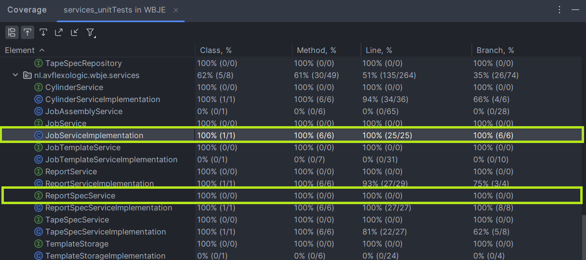

Dit betekent dat alle codepaden in deze klassen minimaal één keer zijn uitgevoerd tijdens het testen. De kern van de businesslogica is hiermee volledig afgedekt en reproduceerbaar getest.

---

<a id="4-9-tests-uitvoeren"></a>

### 4.9 Tests uitvoeren

Alle tests kunnen worden uitgevoerd via IntelliJ IDEA of via het ingebouwde Maven-menu.

---

#### Via IntelliJ

**Alle tests uitvoeren:**

1. Navigeer naar `src/test/java`.
2. Rechtsklik op de testmap.
3. Kies **Run 'All Tests'**.

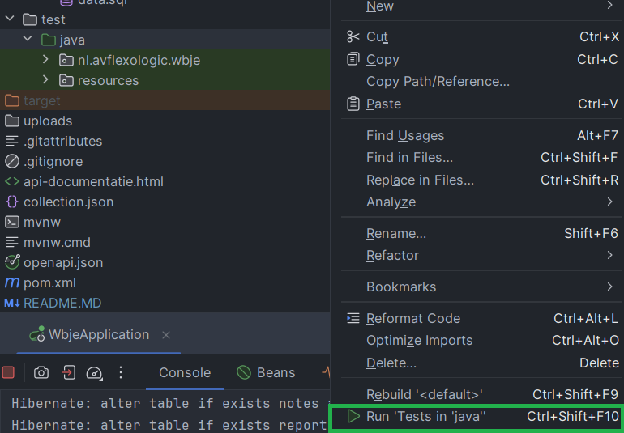

**Specifieke testklasse uitvoeren:**

1. Open de gewenste testklasse.
2. Rechtsklik in de editor.
3. Kies **Run 'TestClassName'**.

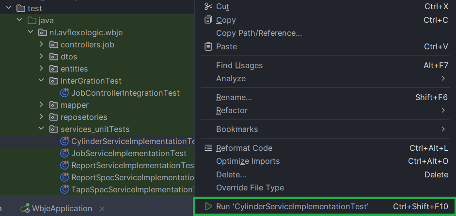

Succesvolle tests worden groen weergegeven in de testconsole.

---

#### Via Maven (IntelliJ Maven-menu)

1. Open het **Maven**-venster in IntelliJ.
2. Ga naar Lifecycle:
3. Dubbelklik op één van de volgende fases:

- **test** → voert alle unit tests en integration tests uit.
- **verify** → voert de volledige build- en verificatiefase uit, inclusief alle tests.

Onderstaand voorbeeld toont het Maven-venster in IntelliJ met de Lifecycle-fases zichtbaar:

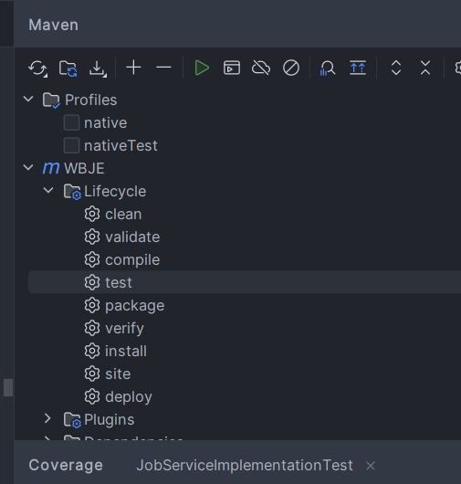

Voor dagelijkse ontwikkeling volstaat doorgaans **test**.  Voor een volledige controle vóór oplevering wordt **verify** aanbevolen.

Voor het uitvoeren van tests hoeft de productie-API niet handmatig gestart te worden.  De Spring Boot testcontext wordt automatisch geïnitialiseerd.

De onderstaande afbeelding illustreert de succesvol uitgevoerde test:

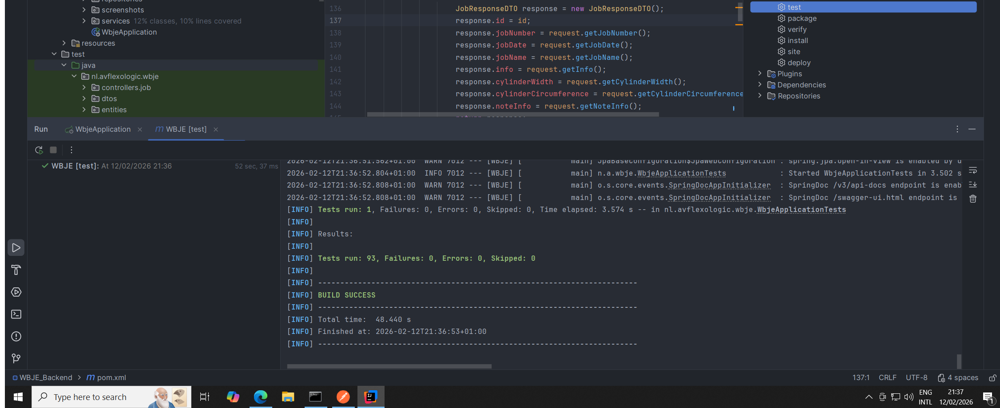

<a id="5-api-documentatie-en-endpoints"></a>

## 5. API-documentatie en endpoints

Dit hoofdstuk beschrijft waar de volledige API-documentatie geraadpleegd kan worden en geeft een overzicht van de beschikbare resources binnen de WBJE-API.

Voor authenticatie- en autorisatie-instellingen wordt verwezen naar hoofdstuk [4.3](#4-3-keycloak-configuratie-windows).  Voor gebruik via Postman wordt verwezen naar hoofdstuk [4.7](#4-7-testen-met-postman).  Voor Swagger en OpenAPI wordt verwezen naar hoofdstuk [4.6](#4-6-swagger-en-openapi).

---

<a id="5-1-api-documentatie"></a>

### 5.1 API-documentatie

De volledige en actuele API-documentatie is beschikbaar in twee vormen, te noemen een HTML offline document en de interactie online Swagger UI.

**1. HTML-documentatie binnen het project:**

De gegenereerde HTML-documentatie bevindt zich in de root van het backend-project:

```
/api-documentatie.html
```

Dit bestand is gegenereerd op basis van de OpenAPI-specificatie en bevat:

- alle beschikbare endpoints
- ondersteunde HTTP-methoden
- request- en response-modellen
- validatieregels
- voorbeeldpayloads
- HTTP-statuscodes

De documentatie kan als volgt opgehaald worden.

**Direct openen in de browser:**

[Open API-documentatie](api-documentatie.html)\*

\* Open lokaal in een browser buiten IntelliJ/GitHub; hiermee is de documentatie offline interactief zichtbaar.

**2. Interactieve Swagger UI (runtime):**

http://localhost:8080/swagger-ui/index.html


De interactieve documentatie wordt automatisch gegenereerd door Springdoc (zie hoofdstuk [4.6](#4-6-swagger-en-openapi)). Dit maakt het mogelijk om endpoints direct te testen.

De machine-leesbare OpenAPI-specificatie is beschikbaar via:

http://localhost:8080/v3/api-docs.yaml


Deze kan gebruikt worden voor SDK-generatie, contract-testing en CI/CD-validatie.

---

<a id="5-2-overzicht-van-beschikbare-resources"></a>

### 5.2 Overzicht van beschikbare resources

Het volgende tabel toont een overzicht van de beschikbare domeinresources binnen de WBJE-API, inclusief hun functionele rol binnen het systeem.

| Resource          | Omschrijving                                                 | Belangrijkste operaties            |
| ----------------- | ------------------------------------------------------------ | ---------------------------------- |
| **Jobs**          | Centrale productie-opdracht. Bevat algemene jobinformatie en vormt de root van het domeinmodel. | `GET`, `POST`, `PUT`, `DELETE`     |
| **Cylinders**     | Onderdeel van een Job. Bevat technische gegevens omtrent de cylinder. | `GET`, `POST`, `PUT`, `DELETE`     |
| **Reports**       | Plaat die op een Cylinder wordt gemonteerd.                  | `GET`, `POST`, `PUT`, `DELETE`     |
| **TapeSpecs**     | Technische specificatie van een tape-type. Herbruikbare configuratie-entiteit. | `GET`, `POST`, `PUT`, `DELETE`     |
| **ReportSpecs**   | Technische specificatie van een plaattype. Herbruikbare configuratie-entiteit. | `GET`, `POST`, `PUT`, `DELETE`     |
| **Notes**         | Optionele aanvullende tekst gekoppeld aan een Job (1 → 0..1). | `GET`, `POST`, `PUT`, `DELETE`     |
| **Job-Templates** | Templates voor herbruikbare jobconfiguraties. Ondersteunt ook downloadfunctionaliteit. | `GET`, `POST`, `DELETE`,`DOWNLOAD` |

De toegangsrechten per endpoint zijn vastgelegd in de RBAC-matrix (zie hoofdstuk [4.7](#4-7-testen-met-postman)).
