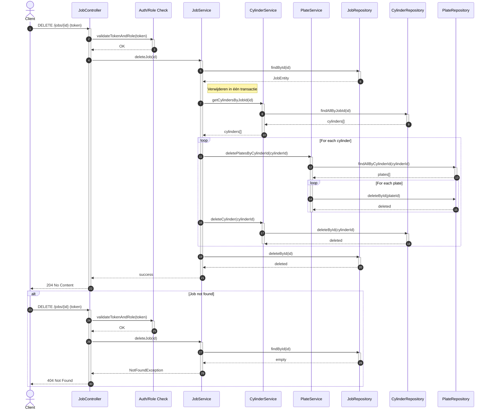

# Web Based Job Editor (WBJE)

## 1. Projectomschrijving
De Web Based Job Editor (WBJE) API vormt de stateless backend voor het aanmaken, bewerken en valideren van montagejobs voor de FAMM 3.0 van AV Flexologic – een volautomatische flexo-plaatmontagemachine met hoge snelheids- en nauwkeurigheidseisen.

Waar de huidige Job Editor fysiek op de machine draait en daardoor productiestilstand veroorzaakt, maakt deze webgebaseerde API het mogelijk om extern en parallel jobs aan te maken zonder de montage te onderbreken. De API faciliteert alle datastromen tussen gebruikersinterface, database en machineconfiguratie.

Kernfunctionaliteiten:
- Jobbeheer (jobs, cylinders, reports, specs)
- Gebruikersrechtenbeheer op basis van Operator en Service rollen
- Jobvalidatie
- Authenticatie via Keycloak
- Bestandsbeheer (upload/download)

## 2. Domeinmodel

Het domeinmodel kan live worden bekeken via deze link:





[Sequence Diagram - Get Job](src/main/java/nl/avflexologic/wbje/classDiagram/sequenceDiagram_GetJob.MMD)

## 3. Sequence diagrams

### 3.1 Get Job

### 3.2 Delete Job

## 4. Benodigde tools
- Java 17
- Maven 3.9+
- PostgreSQL
- Keycloak
- IntelliJ IDEA

## 5. Configuratie
De applicatie vereist correcte sleutelwaarden in application.properties, o.a.:

```
spring.security.oauth2.resourceserver.jwt.issuer-uri=<ISSUER>
spring.security.oauth2.resourceserver.jwt.jwk-set-uri=<JWKS>
auth.client-id=<CLIENT_ID>
auth.client-secret=<CLIENT_SECRET>

spring.datasource.url=jdbc:postgresql://localhost:5432/wbje
spring.datasource.username=wbje_user
spring.datasource.password=<WACHTWOORD>
```

## 6. Database installatie

```sql
CREATE DATABASE wbje;
CREATE USER wbje_user WITH PASSWORD 'SterkWachtwoord123!';
GRANT ALL PRIVILEGES ON DATABASE wbje TO wbje_user;
```

## 7. Gebruikers en rollen

### Operator
- Kan jobdata bekijken.
- Geen write-machtigingen.

### Service
- Volledig lees/schrijf-toegang.
- Mag jobs, cylinders, reports etc. beheren.

## 8. Project starten

```
mvn clean install
mvn spring-boot:run
```

Swagger UI:
```
http://localhost:8080/swagger-ui.html
```

## 9. Maven tests uitvoeren

```

```

## 10. API endpoints (met voorbeelden)
Alle voorbeelden vereisen een geldig Keycloak access token (`Authorization: Bearer <token>`).

### 10.1 Jobs

#### GET /jobs
Voorbeeld:
```
curl -H "Authorization: Bearer <token>" http://localhost:8080/jobs
```

#### GET /jobs/{id}
```
curl -H "Authorization: Bearer <token>" http://localhost:8080/jobs/1
```

#### POST /jobs
```
curl -X POST http://localhost:8080/jobs  -H "Authorization: Bearer <token>"  -H "Content-Type: application/json"  -d '{"number":"1234","name":"Flexo Test","repeat":1200}'
```

#### PUT /jobs/{id}
```
curl -X PUT http://localhost:8080/jobs/1  -H "Authorization: Bearer <token>"  -H "Content-Type: application/json"  -d '{"name":"Nieuwe naam"}'
```

#### DELETE /jobs/{id}
```
curl -X DELETE http://localhost:8080/jobs/1  -H "Authorization: Bearer <token>"
```

### 10.2 Cylinders

#### POST /jobs/{jobId}/cylinders
```
curl -X POST http://localhost:8080/jobs/1/cylinders  -H "Authorization: Bearer <token>"  -H "Content-Type: application/json"  -d '{"cylinderNr":1,"tapeSpecId":10}'
```

### 10.3 Reports

#### POST /cylinders/{cylinderId}/reports
```
curl -X POST http://localhost:8080/cylinders/1/reports  -H "Authorization: Bearer <token>"  -H "Content-Type: application/json"  -d '{"reportSpecId":5}'
```

### 10.4 TapeSpecs

#### POST /tapespecs
```
curl -X POST http://localhost:8080/tapespecs  -H "Authorization: Bearer <token>"  -H "Content-Type: application/json"  -d '{"thickness":1.2,"name":"SoftTape"}'
```

### 10.5 ReportSpecs

#### POST /reportspecs
```
curl -X POST http://localhost:8080/reportspecs  -H "Authorization: Bearer <token>"  -H "Content-Type: application/json"  -d '{"name":"ReportA","description":"Spec A"}'
```

### 10.6 Notes

#### POST /jobs/{id}/note
```
curl -X POST http://localhost:8080/jobs/1/note  -H "Authorization: Bearer <token>"  -H "Content-Type: application/json"  -d '{"text":"Dit is een note"}'
```
