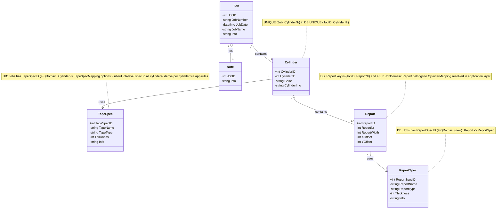

# Web Based Job Editor (WBJE)

## Inhoudsopgave

- [1. Projectomschrijving](#1-projectomschrijving)

- [2. Domeinmodel](#2-domeinmodel)

    - [2.1 Omschrijving domeinmodel](#2-1-omschrijving-domeinmodel)
    - [2.2 Entiteiten](#2-2-entiteiten)
- [3. Sequence diagrams](#3-sequence-diagrams)

    - [3.1 Get Job](#3-1-get-job)
    - [3.2 Omschrijving Get Job operatie](#3-2-omschrijving-get-job-operatie)
    - [3.3 Delete Job](#3-3-delete-job)
    - [3.4 Omschrijving Job delete operatie](#3-4-omschrijving-job-delete-operatie)
- [4. Benodigde dependencies, tools en stappen om de API te draaien](#4-benodigde-dependencies,-tools-en-stappen-om-de-api-te-draaien)

    - [4.1 Vereiste tools](#4-1-vereiste-tools)
    - [4.2 Maven dependencies](#4-2-maven-dependencies)
    - [4.3 Keycloak installeren en starten (Windows)](#4-3-keycloak-installeren-en-starten-(windows))
    - [4.4 Eerste keer inloggen (admin-account aanmaken)](#4-4-eerste-keer-inloggen-(admin-account-aanmaken))
    - [4.5 Importeren van de WBJE-realm](#4-5-importeren-van-de-wbje-realm)
    - [4.6 Samenvatting van de WBJE-realmconfiguratie](#4-6-samenvatting-van-de-wbje-realmconfiguratie)
    - [4.7 PostgreSQL database configuratie](#4-7-postgresql-database-configuratie)
    - [4.8 API starten via IntelliJ](#4-8-api-starten-via-intellij)
    - [4.9 Swagger en OpenAPI](#4-9-swagger-en-openapi)
    - [4.10 Testen met Postman](#4-10-testen-met-postman)
    - [4.11 Tests draaien](#4-11-tests-draaien)
    - [4.12 Complete workflow](#4-12-complete-workflow)
    - [4.13 Testtypen en testdekking](#4-13-testtypen-en-testdekking)
- [5. API endpoints (met voorbeelden)](#5-api-endpoints-(met-voorbeelden))

    - [5.1 Jobs](#5-1-jobs)

    - [5.2 Cylinders](#5-2-cylinders)

    - [5.3 Reports](#5-3-reports)

    - [5.4 TapeSpecs](#5-4-tapespecs)

    - [5.5 ReportSpecs](#5-5-reportspecs)

    - [5.6 Notes](#5-6-notes)

## 1. Projectomschrijving

De Web Based Job Editor (WBJE) API vormt de stateless backend voor het aanmaken, bewerken en valideren van montagejobs voor de FAMM 3.0 van AV Flexologic – een volautomatische flexo-plaatmontagemachine met hoge snelheids- en nauwkeurigheidseisen.


Waar de huidige Job Editor fysiek op de machine draait en daardoor productiestilstand veroorzaakt, maakt deze webgebaseerde API het mogelijk om extern en parallel jobs aan te maken zonder de montage te onderbreken. De API faciliteert alle datastromen tussen gebruikersinterface, database en machineconfiguratie.

Kernfunctionaliteiten:

- Jobbeheer (jobs, cylinders, reports, specs)
- Gebruikersrechtenbeheer op basis van Operator en Service rollen
- Jobvalidatie
- Authenticatie via Keycloak
- Bestandsbeheer (upload/download)


### Projectstructuur

De backend hanteert een gelaagde architectuur waarin verantwoordelijkheden helder zijn gescheiden. Dit bevordert onderhoudbaarheid, testbaarheid en consistent gedrag over de gehele applicatie.

### Controllers
Bevatten de REST-endpoints en verwerken inkomende verzoeken. Validatie vindt plaats op DTO-niveau. Controllers leveren bijna uitsluitend Response-DTO’s terug.

### Services
Implementeert de domeinlogica en bewaakt de toepassingsregels. Services koppelen validatie, mapping en repository-interactie tot één samenhangend geheel.

### Repositories
Spring Data JPA-interfaces voor persistency. Repositories abstraheren de database-interactie en leveren entiteiten aan de servicelaag.

### Entities
JPA-entiteiten waarin de domeinstructuur en onderlinge relaties zijn gedefinieerd. Tabellen zijn één-op-één gerepresenteerd met de entiteiten.

### DTO’s (request/response)
Datatransferobjecten die voorkomen dat interne entiteiten worden blootgesteld. Requests worden gevalideerd; responses bieden een gecontroleerde, stabiele datastructuur richting de client.

### Mappers
Zorgen voor de omzetting tussen entiteiten en DTO’s. Dit houdt conversielogica buiten de controllers en services en maakt deze onderdelen eenvoudiger te testen.

### Configuratie
Omvat beveiliging, OpenAPI, Jackson-instellingen en multipart-configuratie. Hiermee worden de generieke applicatie-eigenschappen centraal beheerd.

### Exceptions
Bevat domeinspecifieke excepties en een centrale exception handler. Fouten worden uniform afgehandeld en vertaald naar consistente HTTP-responses.


<a id="2-domeinmodel"></a>

## 2. Domeinmodel



<a id="2-1-omschrijving-domeinmodel"></a>

### 2.1 Omschrijving domeinmodel

Het domeinmodel volgt hoe het werkproces in het echt gaat. Alles begint bij een job: dat is de complete opdracht. Binnen die job zitten de cylinders, en op die cylinders liggen de reports. De TapeSpec en ReportSpec staan bewust apart. Dit zijn vaste technische gegevens die niet bij elke job veranderen. Door die los te koppelen, worden ze niet telkens opnieuw opgeslagen en blijft het geheel overzichtelijk. Een cylinder verwijst simpelweg naar één TapeSpec, en een report naar één ReportSpec.

In principe komt het neer op:

- een job is de opdracht
- een cylinder is een onderdeel van die opdracht
- een report bevindt zich op die cylinder
- en de specificaties (spec) leveren de vaste technische info die overal hergebruikt wordt.

Op deze manier blijft het model helder, herkenbaar voor iedereen die ermee werkt, en flexibel genoeg om later verder uit te breiden.

<a id="2-2-entiteiten"></a>

### 2.2 Entiteiten

| Entiteit | Omschrijving | Relaties |
| --- | --- | --- |
| **Job** | Centrale entiteit met algemente informatie over een productie opdracht | 1 → 0..1 Note<br>1 → n Cylinders |
| **Note** | Aanvullende tekst bij een job. | 0..1 → 1 Job |
| **Cylinder** | Onderdeel binnen een job, met eigen nummering en eigenschappen (kleur en andere technische info) | n → 1 Job<br>n → 1 TapeSpec<br>1 → 0..n Reports |
| **TapeSpec** | Technische informatie van het tape type | 1 → n Cylinders |
| **Report** | Zijn de platen die zicht op een cylinder bevinden. | n → 1 Cylinder<br>n → 1 ReportSpec |
| **ReportSpec** | Technische informatie van het plaattype | 1 → n Reports |

<a id="3-sequence-diagrams"></a>

## 3. Sequence diagrams

<a id="3-1-get-job"></a>

### 3.1 Get Job

```mermaid
sequenceDiagram
    autonumber

    actor Client
    participant Security as SecurityFilterChain / Keycloak Auth
    participant JobController
    participant JobService
    participant CylinderService
    participant PlateService
    participant JobRepository
    participant CylinderRepository
    participant PlateRepository
    participant JobDTOMapper

%% =================================================
%% 1) Happy flow
%% =================================================
    Client->>Security: GET /jobs/{id} (Authorization: Bearer <token>)
    activate Security

    Security->>Security: validate JWT + roles (Keycloak)
    Security-->>JobController: forward request (OK)
    deactivate Security

    activate JobController
    JobController->>JobService: getJobById(id)
    activate JobService

    JobService->>JobRepository: findById(id)
    activate JobRepository
    JobRepository-->>JobService: JobEntity
    deactivate JobRepository

    JobService->>CylinderService: getCylindersByJobId(jobId)
    activate CylinderService
    CylinderService->>CylinderRepository: findAllByJobId(jobId)
    activate CylinderRepository
    CylinderRepository-->>CylinderService: cylinders[]
    deactivate CylinderRepository
    CylinderService-->>JobService: cylinders[]
    deactivate CylinderService

    loop For each cylinder in cylinders[]
        JobService->>PlateService: getPlatesByCylinderId(cylinderId)
        activate PlateService
        PlateService->>PlateRepository: findAllByCylinderId(cylinderId)
        activate PlateRepository
        PlateRepository-->>PlateService: plates[]
        deactivate PlateRepository
        PlateService-->>JobService: plates[]
        deactivate PlateService
    end

    Note right of JobService: Samenstellen hiërarchie<br/>(Job → Cylinders → Plates)<br/>in service-laag

    JobService->>JobDTOMapper: toResponseDTO(Job + cylinders + plates)
    activate JobDTOMapper
    JobDTOMapper-->>JobService: JobResponseDTO
    deactivate JobDTOMapper

    JobService-->>JobController: JobResponseDTO
    deactivate JobService

    JobController-->>Client: 200 OK (application/json)
    deactivate JobController

%% =================================================
%% 2) Alternative flow: Authentication failed (401)
%% =================================================
    alt Authentication failed (invalid/missing token)
        Client->>Security: GET /jobs/{id} (geen of fout token)
        activate Security

        Security->>Security: validate JWT
        Security-->>Client: 401 Unauthorized
        deactivate Security

        Note right of Client: JobController wordt niet aangeroepen
    end

%% =================================================
%% 3) Alternative flow: Authorization failed (403)
%% =================================================
    alt Authorization failed (role mismatch)
        Client->>Security: GET /jobs/{id} (token zonder juiste rol)
        activate Security

        Security->>Security: validate JWT + roles
        Security-->>Client: 403 Forbidden
        deactivate Security

        Note right of Client: JobController wordt niet aangeroepen
    end

%% =================================================
%% 4) Alternative flow: Job not found (404)
%% =================================================
    alt Job not found
        Client->>Security: GET /jobs/{id} (geldig token)
        activate Security

        Security->>Security: validate JWT + roles
        Security-->>JobController: forward request (OK)
        deactivate Security

        activate JobController
        JobController->>JobService: getJobById(id)
        activate JobService

        JobService->>JobRepository: findById(id)
        activate JobRepository
        JobRepository-->>JobService: empty (no JobEntity)
        deactivate JobRepository

        JobService-->>JobController: throws NotFoundException
        deactivate JobService

        JobController-->>Client: 404 Not Found (via GlobalExceptionHandler)
        deactivate JobController
    end

```


<a id="3-2-omschrijving-get-job-operatie"></a>

### 3.2 Omschrijving Get Job operatie

Het diagram beschrijft de volledige keten die wordt doorlopen wanneer een client een GET-verzoek uitvoert op /jobs/{id}. De verwerking start in de SecurityFilterChain, waar Keycloak het aangeleverde JWT-token controleert op geldigheid en de vereiste rollen. Alleen wanneer deze autorisatie slaagt, wordt de aanvraag doorgestuurd naar de JobController.  
De controller roept vervolgens de JobService aan om de betreffende job op te halen. De service verzamelt de JobEntity, inclusief alle gerelateerde cylinders en de onderliggende plates. Nadat de volledige domeinstructuur is opgebouwd, wordt deze via de JobDTOMapper vertaald naar een JobResponseDTO. De controller levert deze DTO als respons terug aan de client met de statuscode 200 OK.

Het diagram bevat daarnaast drie alternatieve paden:

- 401: wanneer het token ontbreekt of ongeldig is.
- 403: wanneer de gebruiker niet over de vereiste rechten beschikt.
- 404: wanneer de gevraagde job niet bestaat.

Deze alternatieven maken de volledige verwerkingslogica, inclusief de uitzonderingssituaties, in één overzichtelijk schema inzichtelijk.

---

<a id="3-3-delete-job"></a>

### 3.3 Delete Job

```mermaid
sequenceDiagram
autonumber

    actor Client
    participant JobController
    participant AuthFilter as Auth/Role Check
    participant JobService
    participant CylinderService
    participant PlateService
    participant JobRepository
    participant CylinderRepository
    participant PlateRepository

%% ========================
%% 1) Happy flow
%% ========================
Client->>JobController: DELETE /jobs/{id} (token)
activate JobController

    JobController->>AuthFilter: validateTokenAndRole(token)
    activate AuthFilter
    AuthFilter-->>JobController: OK
    deactivate AuthFilter

    JobController->>JobService: deleteJob(id)
    activate JobService

    JobService->>JobRepository: findById(id)
    activate JobRepository
    JobRepository-->>JobService: JobEntity
    deactivate JobRepository

    Note right of JobService: Verwijderen in één transactie

    JobService->>CylinderService: getCylindersByJobId(id)
    activate CylinderService
    CylinderService->>CylinderRepository: findAllByJobId(id)
    activate CylinderRepository
    CylinderRepository-->>CylinderService: cylinders[]
    deactivate CylinderRepository
    CylinderService-->>JobService: cylinders[]
    deactivate CylinderService

    loop For each cylinder
        JobService->>PlateService: deletePlatesByCylinderId(cylinderId)
        activate PlateService

        PlateService->>PlateRepository: findAllByCylinderId(cylinderId)
        activate PlateRepository
        PlateRepository-->>PlateService: plates[]
        deactivate PlateRepository

        loop For each plate
            PlateService->>PlateRepository: deleteById(plateId)
            PlateRepository-->>PlateService: deleted
        end

        deactivate PlateService

        JobService->>CylinderService: deleteCylinder(cylinderId)
        activate CylinderService
        CylinderService->>CylinderRepository: deleteById(cylinderId)
        activate CylinderRepository
        CylinderRepository-->>CylinderService: deleted
        deactivate CylinderRepository
        deactivate CylinderService
    end

    JobService->>JobRepository: deleteById(id)
    activate JobRepository
    JobRepository-->>JobService: deleted
    deactivate JobRepository

    JobService-->>JobController: success
    deactivate JobService

    JobController-->>Client: 204 No Content
    deactivate JobController


%% ========================
%% 2) Alternative flow: Job not found
%% ========================
alt Job not found
Client->>JobController: DELETE /jobs/{id} (token)
activate JobController

        JobController->>AuthFilter: validateTokenAndRole(token)
        activate AuthFilter
        AuthFilter-->>JobController: OK
        deactivate AuthFilter

        JobController->>JobService: deleteJob(id)
        activate JobService

        JobService->>JobRepository: findById(id)
        activate JobRepository
        JobRepository-->>JobService: empty
        deactivate JobRepository

        JobService-->>JobController: NotFoundException
        deactivate JobService

        JobController-->>Client: 404 Not Found
        deactivate JobController
    end
```



<a id="3-4-omschrijving-job-delete-operatie"></a>

### 3.4 Omschrijving Job delete operatie

Het sequentiediagram toont de afhandeling van een DELETE-verzoek naar /jobs/{id}. De aanvraag passeert eerst de SecurityFilterChain, waar Keycloak het JWT-token en de vereiste rollen valideert. Na succesvolle autorisatie wordt de JobController aangeroepen, die de JobService inschakelt om de verwijderoperatie uit te voeren.  
De service controleert of de betreffende job bestaat. Wanneer dit het geval is, worden binnen één transactie eerst alle gekoppelde cylinders opgehaald, vervolgens hun onderliggende plates verwijderd, daarna de cylinders zelf en ten slotte de job. De controller retourneert een 204 No Content als bevestiging van de succesvolle verwijdering.

Het diagram bevat daarnaast drie alternatieve paden:

- 401: ongeldig of ontbrekend token.
- 403: onvoldoende rechten.
- 404: de opgegeven job bestaat niet.

Deze alternatieven maken de volledige verwerkingslogica, inclusief de uitzonderingssituaties, in één overzichtelijk schema inzichtelijk.

<a id="4-benodigde-dependencies,-tools-en-stappen-om-de-api-te-draaien"></a>

## 4. Benodigde dependencies, tools en stappen om de API te draaien

Dit hoofdstuk beschrijft alle vereiste tools, afhankelijkheden, configuratiestappen en uitvoerprocedures om de WBJE-API lokaal te draaien, te testen en te benaderen. De workflow is gebaseerd op IntelliJ IDEA, Maven, Spring Boot, Keycloak, PostgreSQL en Postman.

---

<a id="4-1-vereiste-tools"></a>

### 4.1 Vereiste tools

De volgende tools zijn noodzakelijk voor lokale ontwikkeling en uitvoering:

- **Java Development Kit (JDK 17)**
- **IntelliJ IDEA**
- **Maven (3.8+)**
- **Keycloak (22+)**
- **PostgreSQL**
- **Postman**

---

<a id="4-2-maven-dependencies"></a>

### 4.2 Maven dependencies

- `spring-boot-starter-web`
- `spring-boot-starter-data-jpa`
- `spring-boot-starter-security`
- `spring-boot-starter-validation`
- PostgreSQL JDBC-driver
- OAuth2 Resource Server
- springdoc-openapi
- JUnit + Mockito

---

<a id="4-3-keycloak-installeren-en-starten-(windows)"></a>

### 4.3 Keycloak installeren en starten (Windows)

#### Installatie (Windows)

1. Download Keycloak via https://www.keycloak.org/downloads
2. Pak het zip-bestand uit.
3. Open een terminal in de Keycloak-map.

#### Keycloak starten (Windows)

bin\kc.bat start-dev --http-port 9090

- Keycloak draait op `http://localhost:9090`
- Developer-mode is verplicht tijdens lokale ontwikkeling.

#### Eerste keer inloggen (admin-account aanmaken)

Wanneer Keycloak voor de eerste keer wordt opgestart:

<a id="4-4-eerste-keer-inloggen-(admin-account-aanmaken)"></a>

### 4.4 Eerste keer inloggen (admin-account aanmaken)

1. Navigeer naar:  
   `http://localhost:9090`

2. Maak vervolgens het Keycloak administrator-account aan.  
   Voor lokale ontwikkeling wordt aangeraden om de volgende inloggegevens te gebruiken:

**Gebruikersnaam:** `admin`  
**Wachtwoord:** `admin`

*(Deze waarden zijn uitsluitend geschikt voor development. Gebruik in productie altijd sterke, unieke credentials.)*

3. Log daarna in op de Admin Console met dit nieuwe admin-account.


---

<a id="4-5-importeren-van-de-wbje-realm"></a>

### 4.5 Importeren van de WBJE-realm

1. Start Keycloak.
2. Open de **Admin Console**.
3. Links bovenin → Realm selector → klik op **Create realm**.
4. In het scherm **Create realm**:
    - Onder **Import from resource file** klik je op **Browse…**.
    - Selecteer het bestand `WBJE_realm-export.json`.
    - De realmnaam wordt automatisch ingevuld (of vul `WBJE` in wanneer dit niet gebeurt).
    - Zorg dat de slider **Enabled** direct op **ON** gezet wordt.
5. Klik op **Create** om de realm aan te maken op basis van het geïmporteerde bestand.

Na deze stappen is de volledige WBJE-securityconfiguratie (rollen, clients, realm-instellingen) actief en klaar voor gebruik.

---

<a id="4-6-samenvatting-van-de-wbje-realmconfiguratie"></a>

### 4.6 Samenvatting van de WBJE-realmconfiguratie

#### Realm

- Naam: `WBJE`
- Access token lifespan: `300s`

#### Rollen (client-rollen)

- `ROLE_ADMIN`
- `ROLE_USER`

#### Backend Client

- Client ID: `WBJEBackend`
- Protocol: OpenID Connect

#### Redirect URIs

- `http://localhost:8080/swagger-ui/oauth2-redirect.html`
- `https://oauth.pstmn.io/v1/callback`
- `*` (voor development)

#### Web Origins

- `/*`
- `*`

---

<a id="4-7-postgresql-database-configuratie"></a>

### 4.7 PostgreSQL database configuratie

De PostgreSQL‑database dient vooraf ingericht te worden zodat de WBJE API correct kan verbinden en schema’s kan aanmaken.

#### Database aanmaken

Maak een nieuwe database aan:

- **Database naam:** `wbje`
- **Gebruiker:** `postgres`
- **Wachtwoord:** `password`

Gebruik hiervoor bijvoorbeeld psql:

```sql
CREATE DATABASE wbje;
CREATE USER postgres WITH ENCRYPTED PASSWORD 'password';
GRANT ALL PRIVILEGES ON DATABASE wbje TO postgres;
```

#### JDBC configuratie in Spring Boot

De configuratie moet overeenkomen met:

```
spring.datasource.url=jdbc:postgresql://localhost:5432/wbje
spring.datasource.username=user
spring.datasource.password=password
```

<a id="4-8-api-starten-via-intellij"></a>

### 4.8 API starten via IntelliJ


Het project kan op meerdere manieren in IntelliJ IDEA worden geopend: rechtstreeks vanuit de repository, via een lokale projectmap, of via een pull request. Voor alle opties geldt dezelfde vervolgstap om de API te starten.

---

### Project openen

1. Open **IntelliJ IDEA**.
2. Kies één van de volgende opties:
    - **File → Open…** en selecteer de projectmap,
    - **Git → Clone…** en vul de repository-URL in,
    - **Git → GitHub → View Pull Requests** en kies **Checkout Pull Request**.
3. IntelliJ herkent automatisch de `pom.xml` en importeert het Maven‑project.
4. Wacht tot rechtsonder **“Maven project imported”** verschijnt.

---

### De WBJE API starten

1. Navigeer naar:
   ```
   src/main/java/.../WbjeApplication.java
   ```
2. Open dit bestand.
3. Start de applicatie via:
    - **Right‑click → Run 'WbjeApplication'**, of
    - De **groene Run‑knop**.
4. Nadat de applicatie is gestart, is de API bereikbaar op:
   ```
   http://localhost:8080
   ```

Met deze stappen kan de WBJE‑backend eenvoudig lokaal worden uitgevoerd, ongeacht hoe het project is geladen.


---

<a id="4-9-swagger-en-openapi"></a>

### 4.9 Swagger en OpenAPI

Swagger en OpenAPI vormen de auto-gegenereerde documentatie van de WBJE-API.  
Wanneer de Spring Boot-applicatie draait, wordt automatisch een complete en interactieve UI beschikbaar gesteld via Swagger. Hiermee kun je:

- alle endpoints bekijken
- per endpoint zien welke HTTP-methoden worden ondersteund
- request- en response-modellen inzien
- direct API-calls uitvoeren **zonder Postman**

- de volledige API-specificatie downloaden als **OpenAPI YAML**

Swagger UI is ideaal voor debugging, functioneel testen, API-review, en verificatie van mappers/DTO’s.

### Swagger UI

Swagger UI is beschikbaar via:

```
http://localhost:8080/swagger-ui/index.html
```

Het opent een interactieve webpagina zoals hieronder:


### OpenAPI YAML

De volledige OpenAPI-specificatie (machine-leesbaar, bedoeld voor tooling) is beschikbaar op:

```
http://localhost:8080/v3/api-docs.yaml
```

Deze YAML-file kan worden gebruikt voor:

- genereren van client-SDK’s (TypeScript, Java, C#, Python, etc.)
- importeren in Postman of Insomnia
- API-validatie
- documentatie-automation
- CI/CD-validatie (contract-tests)

Springdoc genereert deze YAML live op basis van controllers, DTO’s, validatie-annotaties en Swagger-configuratie.


---

<a id="4-10-testen-met-postman"></a>

### 4.10 Testen met Postman

1. Start Keycloak + WBJE API + Postman
2. Importeer `WBJE.postman_collection.json` in Postman
3. Selecteer of maak een Postman environment
4. Verzend requests zodra token-configuratie actief is

De meegeleverde Postman-collectie bevat al een volledig geconfigureerde OAuth2-instelling. Hierdoor kun je direct een access token ophalen en aanvragen uitvoeren.  
Mocht je de OAuth-instellingen handmatig willen aanmaken of controleren, volg dan onderstaande uitleg.

---

### Handmatige OAuth2-configuratie (indien nodig)

De collectie bevat per request een OAuth2-configuratie met de volgende parameters:

| Parameter | Waarde |
| --- | --- |
| **Auth URL** | `http://localhost:9090/realms/WBJE/protocol/openid-connect/auth` |
| **Token URL** | `http://localhost:9090/realms/WBJE/protocol/openid-connect/token` |
| **Client ID** | `WBJEBackend` |
| **Client Secret** | *(dezelfde secret als in jouw backend-project)* |
| **Scope** | `openid` |
| **Grant Type** | Authorization Code of Password |
| **Browser login** | Enabled |

> Let op: in de Postman-collectie staat een *clientSecret* ingevuld.  
> Dit betekent dat jouw Keycloak-client is ingesteld als **confidential client**.

---

### Access token ophalen

1. Open een request zoals **GetStuff**
2. Ga naar **Authorization**
3. Kies **OAuth 2.0**
4. Klik **Get New Access Token**
5. Browser opent Keycloak-login
6. Log in als `operator` of `admin`
7. Klik **Use Token**

---

### Rollen & Autorisatie (RBAC)

De Web Based Job Editor (WBJE) maakt gebruik van Keycloak voor authenticatie en autorisatie.  
Binnen deze applicatie bestaan twee functionele rollen:

| Keycloak Rol | Beschrijving |
| --- | --- |
| **ROLE_ADMIN** | Volledige beheertoegang. Mag alle entiteiten inclusief configuratie-objecten (TapeSpecs, ReportSpecs, Templates) aanmaken, wijzigen en verwijderen. |
| **ROLE_USER** | Operator-rechten. Mag alle operationele entiteiten (Jobs, Cylinders, Reports) volledig beheren (CRUD). Mag configuratie-objecten uitsluitend lezen. |

## 👥 Testgebruikers

Voor testen met Swagger UI, Postman en de frontend kunnen de volgende Keycloak-gebruikers worden gebruikt:

| Username | Password | Toegewezen rol |
| --- | --- | --- |
| **Operator** | `password` | **ROLE_USER** |
| **Service** | `password` | **ROLE_ADMIN** |

---

## Role-Endpoint Matrix

Onderstaande tabel toont per endpoint en HTTP-methode welke rol toegang heeft.

> **Legenda:**  
> ✔ = toegang toegestaan  
> ✖ = geen toegang

| Endpoint | Methode | ROLE_ADMIN (Service) | ROLE_USER (Operator) |
| --- | --- | --- | --- |
| `/tape-specs` | GET | ✔   | ✔   |
| `/tape-specs` | POST | ✔   | ✖   |
| `/tape-specs/{id}` | GET | ✔   | ✔   |
| `/tape-specs/{id}` | PUT | ✔   | ✖   |
| `/tape-specs/{id}` | DELETE | ✔   | ✖   |
| `/report-specs` | GET | ✔   | ✔   |
| `/report-specs` | POST | ✔   | ✖   |
| `/report-specs/{id}` | GET | ✔   | ✔   |
| `/report-specs/{id}` | PUT | ✔   | ✖   |
| `/report-specs/{id}` | DELETE | ✔   | ✖   |
| `/reports` | GET | ✔   | ✔   |
| `/reports` | POST | ✔   | ✔   |
| `/reports/{id}` | GET | ✔   | ✔   |
| `/reports/{id}` | PUT | ✔   | ✔   |
| `/reports/{id}` | DELETE | ✔   | ✔   |
| `/jobs` | GET | ✔   | ✔   |
| `/jobs` | POST | ✔   | ✔   |
| `/jobs/{id}` | GET | ✔   | ✔   |
| `/jobs/{id}` | PUT | ✔   | ✔   |
| `/jobs/{id}` | DELETE | ✔   | ✔   |
| `/jobs/full` | POST | ✔   | ✔   |
| `/jobs/{jobId}/cylinders` | GET | ✔   | ✔   |
| `/jobs/{jobId}/cylinders` | POST | ✔   | ✔   |
| `/jobs/{jobId}/cylinders/{cylinderId}` | GET | ✔   | ✔   |
| `/jobs/{jobId}/cylinders/{cylinderId}` | PUT | ✔   | ✔   |
| `/jobs/{jobId}/cylinders/{cylinderId}` | DELETE | ✔   | ✔   |
| `/job-templates` | GET | ✔   | ✔   |
| `/job-templates` | POST | ✔   | ✖   |
| `/job-templates/{id}` | GET | ✔   | ✔   |
| `/job-templates/{id}` | DELETE | ✔   | ✖   |
| `/job-templates/{id}/download` | GET | ✔   | ✔   |
| `/public` | GET | ✔   | ✔   |
| `/private` | GET | ✖   | ✔   |
| `/admin` | GET | ✔   | ✖   |
| `/roles` | GET | ✔   | ✔   |
| `/hello` | GET | ✔   | ✔   |
| `/debug-auth` | GET | ✔   | ✔   |
---

### Tokens verversen

De WBJE realm gebruikt een token lifespan van **300 seconden**. Bij 401-fouten:

- opnieuw **Get New Access Token**
- of een environment-script gebruiken dat automatisch overtijd-tokens vernieuwt

---


<a id="4-11-tests-draaien"></a>

### 4.11 Tests draaien

**Via IntelliJ:**  
Rechtsklik op `src/test/java` → *Run All Tests*

**Via Maven:**
mvn test
mvn clean verify

---

<a id="4-12-complete-workflow"></a>

### 4.12 Complete workflow

[//]: # (1. Installeer alle tools)

[//]: # (2. Start Keycloak)

[//]: # (3. Maak admin-account aan &#40;alleen eerste keer&#41;)

[//]: # (4. Importeer WBJE-realm)

[//]: # (5. Start IntelliJ + API)

[//]: # (6. Open Swagger)

[//]: # (7. Gebruik Postman)

[//]: # (8. Draai tests)

---

<a id="4-13-testtypen-en-testdekking"></a>

### 4.13 Testtypen en testdekking

#### Unit Tests


#### Integration Tests


#### Dekking

- **100% code coverage**

<a id="5-api-endpoints-(met-voorbeelden)"></a>

## 5. API endpoints (met voorbeelden)

Alle voorbeelden vereisen een geldig Keycloak access token (`Authorization: Bearer <token>`).

<a id="5-1-jobs"></a>

### 5.1 Jobs

#### GET /jobs

Voorbeeld:

```
curl -H "Authorization: Bearer <token>" http://localhost:8080/jobs
```

#### GET /jobs/{id}

```
curl -H "Authorization: Bearer <token>" http://localhost:8080/jobs/1
```

#### POST /jobs

```
curl -X POST http://localhost:8080/jobs  -H "Authorization: Bearer <token>"  -H "Content-Type: application/json"  -d '{"number":"1234","name":"Flexo Test","repeat":1200}'
```

#### PUT /jobs/{id}

```
curl -X PUT http://localhost:8080/jobs/1  -H "Authorization: Bearer <token>"  -H "Content-Type: application/json"  -d '{"name":"Nieuwe naam"}'
```

#### DELETE /jobs/{id}

```
curl -X DELETE http://localhost:8080/jobs/1  -H "Authorization: Bearer <token>"
```

<a id="5-2-cylinders"></a>

### 5.2 Cylinders

#### POST /jobs/{jobId}/cylinders

```
curl -X POST http://localhost:8080/jobs/1/cylinders  -H "Authorization: Bearer <token>"  -H "Content-Type: application/json"  -d '{"cylinderNr":1,"tapeSpecId":10}'
```

<a id="5-3-reports"></a>

### 5.3 Reports

#### POST /cylinders/{cylinderId}/reports

```
curl -X POST http://localhost:8080/cylinders/1/reports  -H "Authorization: Bearer <token>"  -H "Content-Type: application/json"  -d '{"reportSpecId":5}'
```

<a id="5-4-tapespecs"></a>

### 5.4 TapeSpecs

#### POST /tapespecs

```
curl -X POST http://localhost:8080/tapespecs  -H "Authorization: Bearer <token>"  -H "Content-Type: application/json"  -d '{"thickness":1.2,"name":"SoftTape"}'
```

<a id="5-5-reportspecs"></a>

### 5.5 ReportSpecs

#### POST /reportspecs

```
curl -X POST http://localhost:8080/reportspecs  -H "Authorization: Bearer <token>"  -H "Content-Type: application/json"  -d '{"name":"ReportA","description":"Spec A"}'
```

<a id="5-6-notes"></a>

### 5.6 Notes

#### POST /jobs/{id}/note

```
curl -X POST http://localhost:8080/jobs/1/note  -H "Authorization: Bearer <token>"  -H "Content-Type: application/json"  -d '{"text":"Dit is een note"}'
```